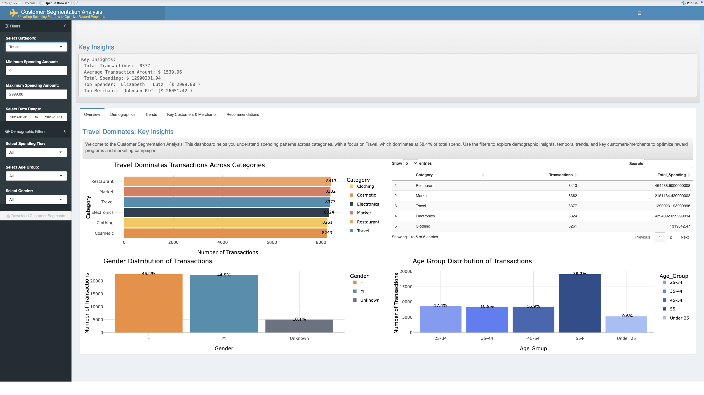
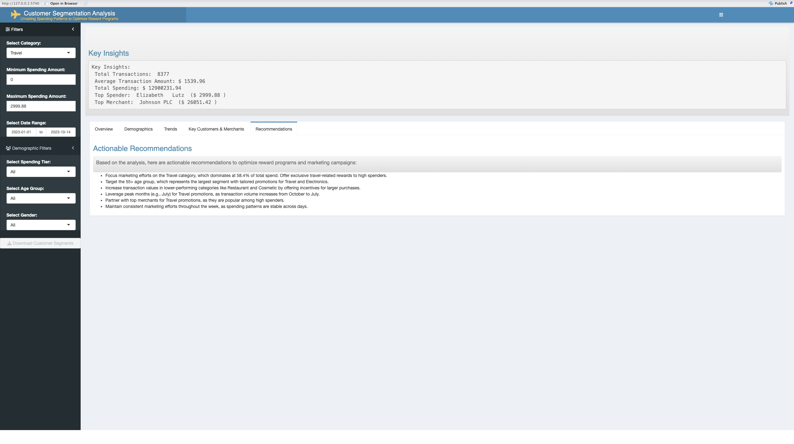
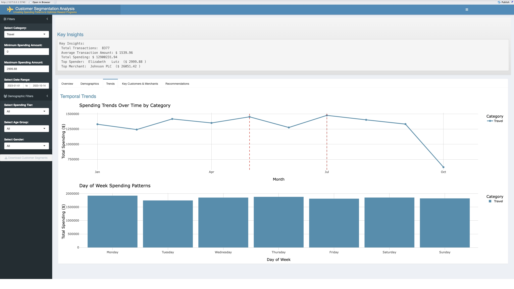
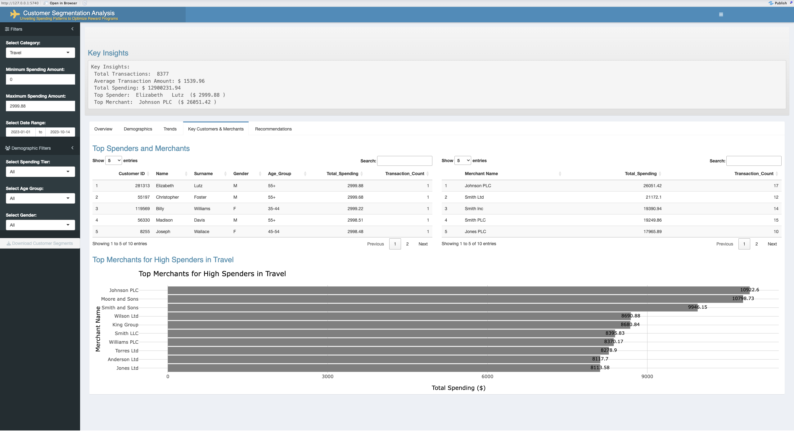
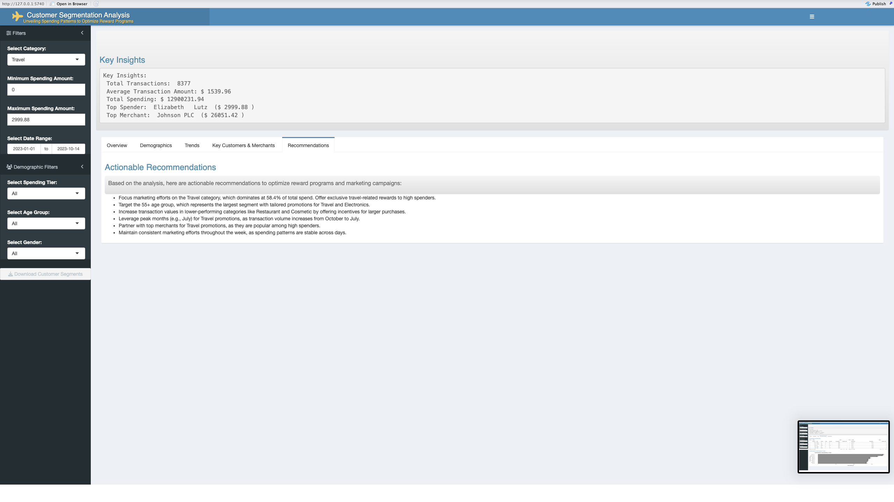
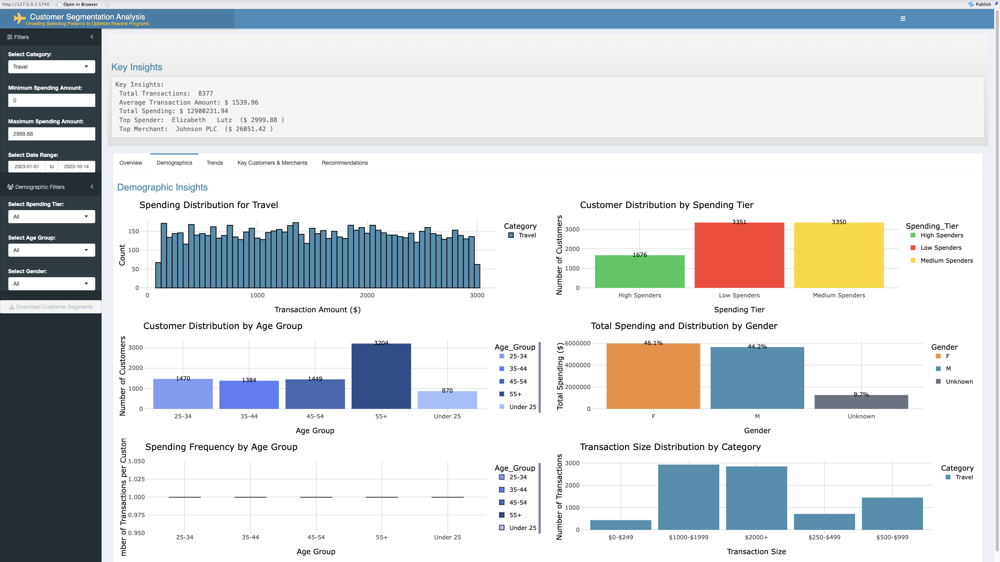

# Customer Segmentation Analysis Shiny App




**Author:** Darpan Radadiya
**Date:** March 23, 2025

---

## 🚀 Overview

This R Shiny application performs customer segmentation analysis on credit card transaction data to uncover spending patterns and deliver actionable insights for optimizing reward programs and marketing campaigns.

---

## 🎯 Key Features

* **Interactive Filters**: Category, spending range, date range, spending tier, age group, and gender
* **Summary Insights**: Total transactions, average transaction amount, total spend, top spender, and top merchant
* **Dynamic Tabs**:

  * **Overview**: Category dominance, gender & age distributions
  * **Demographics**: Spending histograms, tier breakdown, customer counts by age and gender, transaction size & frequency analyses
  * **Trends**: Monthly spending trends with highlighted peak months, day-of-week spending patterns
  * **Key Customers & Merchants**: Top customer & merchant tables, top merchants for high spenders in Travel
  * **Recommendations**: Business‑driven, data‑backed action items

---

## 🛠 Technology Stack

* **Languages & Frameworks:** R, Shiny, shinydashboard, shinydashboardPlus
* **Data Manipulation & Visualization:** dplyr, ggplot2, plotly, DT, lubridate, shinyWidgets
* **Data Source:** `credit_card_transaction_flow.csv` containing Customer ID, Name, Surname, Birthdate, Gender, Date, Transaction Amount, Category, Merchant Name

---

## ⚙️ Installation & Usage

1. **Clone the repository:**

   ```bash
   git clone https://github.com/<username>/customer-segmentation-shiny.git
   cd customer-segmentation-shiny
   ```
2. **Install required R packages:**

   ```r
   install.packages(c(
     "shiny", "shinydashboard", "shinydashboardPlus",
     "dplyr", "ggplot2", "readr", "plotly",
     "DT", "lubridate", "shinyWidgets"
   ))
   ```
3. **Place your dataset** (`credit_card_transaction_flow.csv`) in the app directory.
4. **Run the app:**

   ```r
   library(shiny)
   runApp("app.R")
   ```

---

## 📈 Business Recommendations

1. **Focus on Travel:** Travel accounts for 58.4% of total spend. Offer exclusive travel‑related rewards to high spenders.
2. **Target the 55+ Segment:** The 55+ age group is the largest demographic; tailor promotions around Travel and Electronics.
3. **Boost Lower‑Performing Categories:** Incentivize larger purchases in Restaurant and Cosmetic categories.
4. **Leverage Seasonal Peaks:** Deploy major Travel campaigns during peak months (e.g., July).
5. **Partner with Top Merchants:** Collaborate with high‑value merchants to maximize ROI on promotions.
6. **Maintain Consistent Engagement:** Schedule marketing efforts evenly across the week to match stable daily spending patterns.

---

## 📸 Screenshots

> *All images are in the **`screenshots/`** directory.*

### 1. Overview Tab


*Insight:* Highlights overall category dominance—showing that **Travel** represents the highest share of transactions and spend, guiding focus for reward optimization.\*

### 2. Demographics Tab



*Insight:* Illustrates spending distribution by age groups and tiers, revealing that the **55+** cohort and **High Spenders** cluster are key segments for targeted promotions.\*

### 3. Trends Tab


*Insight:* Displays monthly spending trends with peak months marked—enabling planning of **seasonal campaigns** (e.g. July) when customer activity surges.\*

### 4. Key Customers & Merchants Tab



*Insight:* Lists **top spenders** and **merchant partners**, identifying high-value customers and preferred merchants for partnership and cross-promotion strategies.\*

### 5. Recommendations Tab



*Insight:* Summarizes actionable, data-backed recommendations—such as exclusive travel rewards and lower-category incentives—ready for strategic implementation.\*

### 6. Key Insights Panel



*Insight:* Provides a concise snapshot of total transactions, average ticket size, and leading customer/merchant, serving as an executive summary for stakeholders.\*

### 7. Top Spenders & Merchants Table



*Insight:* A tabular view of the **top 10 customers** and **merchants**, essential for recognizing VIP clients and optimizing retailer relationships.\*


---

*Thank you for exploring this analysis. For questions or contributions, feel free to open an issue or reach out directly!*
